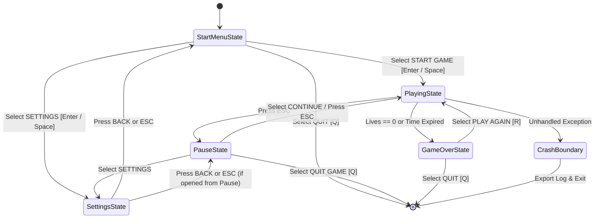
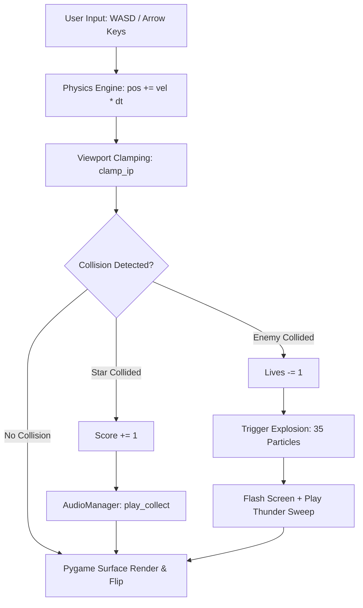
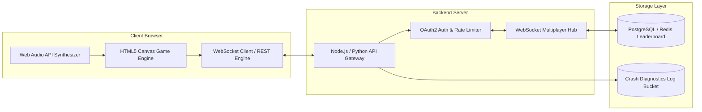

# System Architecture & Technical Diagrams — Star Catcher Engine

This document provides visual architectural diagrams, state machine flows, and data models to present to Senior Software Architects, Lead Developers, and Project Evaluators.

---

## 1. Finite State Machine (FSM) State Diagram

The diagram below illustrates how `main_game.py` routes user inputs, game loops, menu transitions, and error boundaries without blocking the main execution thread:

---

## 2. Audio & Physics Rendering Pipeline

The diagram below outlines how player input events flow through delta-time physics calculation, collision detection, and procedural sound synthesis:

---

## 3. Future Web System Port & API Architecture

The diagram below illustrates the future web system architecture connecting the HTML5 game client, WebSockets server, and online leaderboard database:

---

## 4. Developer Technical Summary for Architect Review

- **Architecture Pattern**: Finite State Machine (FSM) with decoupled Component-like State Handlers.
- **Physics Engine**: Frame-Rate Independent Delta-Time (`dt`) Physics Engine.
- **Audio Engine**: Buffer-level Sinusoidal Frequency & White Noise Synthesizer (`struct` / `bytearray`).
- **Resilience Boundary**: Global Exception Handler with structured logging (`crash_log.txt`).
